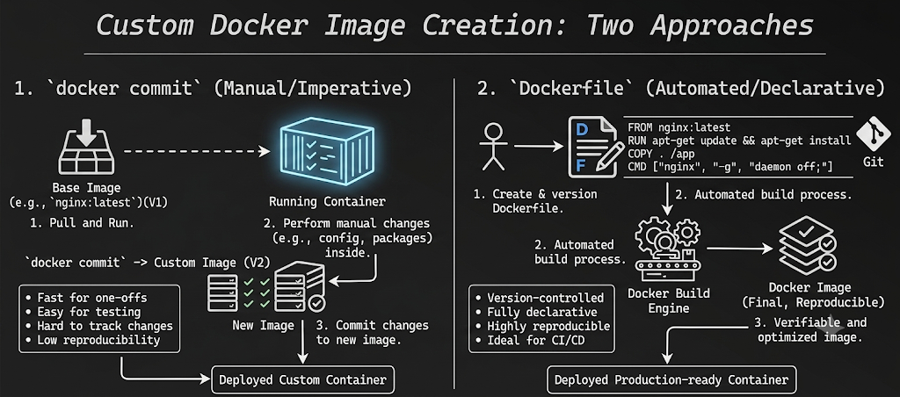

# Custom Docker Image Creation: `docker commit` vs. `Dockerfile`

This guide contrasts the two primary methods for generating custom Docker images: the manual/imperative workflow (`docker commit`) and the automated/declarative script workflow (`Dockerfile`).

---

## Visual Architectural Overview

The architectural differences, from source inputs to finalized running containers, are fully detailed in the diagram below (reconstructed from user conceptual sketches):


*Referenced source layout from input `image_f58cfe.jpg`.*



---

## 1. `docker commit` (Manual / Imperative)

Captures a point-in-time snapshot of an active, manually altered container.

### The Workflow
1. **Pull & Run (V1):** Spin up a container from a vanilla base image (e.g., `nginx:latest`).
2. **Manual Mutation:** Shell into the container interactively (`docker exec`) to inject configuration, scripts, or patches.
3. **Commit Snapshot (V2):** Freeze the modifications using `docker commit <container_id> <new_image_name>`.

```bash
# Example Workflow
docker run -d --name temp-container nginx:latest
docker exec -it temp-container apt-get update && apt-get install -y curl
docker commit temp-container nginx-custom:v2
```

### Characteristics
* ⚡ **Pros:** Ideal for quick troubleshooting, localized testing, and rapid prototyping.
* ❌ **Cons:** Creates an un-auditable "black box" image, bypasses version control, results in larger bloated layers, and lacks reproducibility.

---

## 2. `Dockerfile` (Automated / Declarative)

Uses a version-controlled script recipe to automatically and sequentially build clean, structured layers.

### The Workflow
1. **Define Code:** Write structured configuration parameters into a flat configuration file.
2. **Automate Build:** Trigger the execution engine to assemble layers deterministically.
3. **Verify Output:** Generate a standard, reproducible image structure ready for orchestration.

```dockerfile
# Example Dockerfile
FROM nginx:latest
RUN apt-get update && apt-get install -y curl
COPY ./html /usr/share/nginx/html
CMD ["nginx", "-g", "daemon off;"]
```

```bash
# Execution Command
docker build -t nginx-custom:v2 .
```

### Characteristics
* 🎯 **Pros:** Natively tracks through Git, natively integrates with CI/CD platforms, ensures 100% deterministic builds, and minimizes layer footprint.
* 🛠️ **Cons:** Requires initial syntax overhead and familiarity with layer caching rules.

---

## Strategic Summary

| Metric | `docker commit` Approach | `Dockerfile` Standard |
| :--- | :--- | :--- |
| **Execution Type** | Imperative / Manual Steps | Declarative / Structured Code |
| **Reproducibility** | Poor (Memory reliant) | Absolute (Deterministic) |
| **Git Governance** | Non-existent | Excellent |
| **Target Use Case** | Ad-hoc debugging & One-offs | Production Environment & Pipelines |


